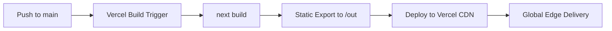

# Design Document: Nudg Marketing Website

## Overview

The Nudg marketing website is a statically generated, single-page marketing site built with Next.js (App Router), Tailwind CSS, and TypeScript, deployed to Vercel. It showcases the Nudg iOS app's value proposition to small service business owners through a modern, minimal landing page.

The site is entirely read-only — no forms, no user input, no authentication, no API routes, no server runtime. All content is hardcoded at build time. The architecture prioritizes performance (Lighthouse 90+), accessibility (Lighthouse 95+), and mobile-first responsive design.

**Key design decisions:**
- **Static export** (`output: 'export'` in next.config) — produces flat HTML/CSS/JS with zero server dependencies
- **Single-page landing** with smooth-scroll navigation to sections, plus `/privacy` and `/terms` as separate pages
- **Component-driven** — each page section is an isolated, reusable component
- **Tailwind CSS only** — no CSS-in-JS, no external component libraries. Custom design tokens for Nudg brand.
- **Inter font** loaded via `next/font/google` for optimal performance (no layout shift)
- **Subtle animations** via CSS (`@keyframes` + Intersection Observer) with `prefers-reduced-motion` media query respect. No heavy animation libraries.

## Architecture

### High-Level Architecture

```mermaid
graph TD
    subgraph "Build Time (next build)"
        A[Next.js App Router] --> B[Static HTML Generation]
        B --> C[/out/ directory]
        C --> D[HTML + CSS + JS + Images]
    end

    subgraph "Deploy"
        D --> E[Vercel CDN]
    end

    subgraph "Runtime (Browser)"
        E --> F[Visitor Browser]
        F --> G[Hydrated React Components]
        G --> H[Smooth Scroll Navigation]
        G --> I[Mobile Menu Toggle]
        G --> J[Scroll-triggered Animations]
    end
```

### Rendering Strategy

All pages use static generation at build time. No `getServerSideProps`, no `fetch` at request time, no dynamic routes.

| Page | Path | Content |
|------|------|---------|
| Home | `/` | Landing page with all marketing sections |
| Privacy | `/privacy` | Privacy policy (static text) |
| Terms | `/terms` | Terms of service (static text) |

### Client-Side Interactivity (Minimal)

The only client-side JavaScript behaviors are:
1. **Smooth scrolling** — navigation link clicks scroll to section anchors
2. **Mobile menu toggle** — hamburger menu open/close with focus trapping
3. **Scroll-triggered animations** — Intersection Observer fires CSS class additions for fade-in/slide-up
4. **Sticky navigation** — handled by CSS `position: sticky` (no JS needed)

### Build & Deploy Pipeline



## Components and Interfaces

### File Structure

```
nudg-website/
├── app/
│   ├── layout.tsx              # Root layout: fonts, metadata, global styles
│   ├── page.tsx                # Home page: composes all landing sections
│   ├── privacy/
│   │   └── page.tsx            # Privacy policy page
│   └── terms/
│       └── page.tsx            # Terms of service page
├── components/
│   ├── layout/
│   │   ├── Navbar.tsx          # Sticky navigation with mobile menu
│   │   ├── Footer.tsx          # Site footer with links & branding
│   │   └── SectionWrapper.tsx  # Consistent section spacing/max-width
│   ├── sections/
│   │   ├── Hero.tsx            # Hero section with headline + phone mockup
│   │   ├── HowItWorks.tsx      # 6-step flow section
│   │   ├── Features.tsx        # 10-feature grid section
│   │   ├── SmsDemo.tsx         # SMS conversation mockup section
│   │   ├── Pricing.tsx         # 3-tier pricing cards section
│   │   ├── SocialProof.tsx     # Industries + testimonial section
│   │   └── BottomCta.tsx       # Final CTA section
│   └── ui/
│       ├── Button.tsx          # Reusable button (primary/secondary variants)
│       ├── FeatureCard.tsx     # Feature icon + title + description card
│       ├── PhoneMockup.tsx     # Device frame wrapping app screenshots
│       ├── StepCard.tsx        # How-it-works step card
│       ├── PricingCard.tsx     # Pricing tier card
│       ├── SmsBubble.tsx       # Chat message bubble component
│       ├── AnimateOnScroll.tsx  # Intersection Observer wrapper
│       └── Icon.tsx            # SVG icon component
├── lib/
│   ├── constants.ts            # Brand colors, pricing data, features data, steps data
│   ├── metadata.ts             # SEO metadata helpers
│   └── types.ts                # TypeScript interfaces
├── public/
│   ├── images/
│   │   ├── mockups/            # Phone mockup screenshots
│   │   ├── icons/              # Feature/step SVG icons
│   │   └── og-image.png        # Open Graph image (1200×630)
│   ├── favicon.ico             # 16×16 favicon
│   ├── favicon-32x32.png       # 32×32 favicon
│   ├── sitemap.xml             # Generated at build time
│   └── robots.txt              # Search engine directives
├── tailwind.config.ts          # Custom Nudg design tokens
├── next.config.mjs             # Static export config
├── package.json
└── tsconfig.json
```

### Component Signatures

#### Layout Components

```typescript
// components/layout/Navbar.tsx
interface NavbarProps {}
export function Navbar(): JSX.Element;
// Sticky nav with logo, section links, App Store CTA, mobile hamburger menu
// State: isMenuOpen (boolean) for mobile menu toggle
// Focus trapping when mobile menu is open

// components/layout/Footer.tsx
interface FooterProps {}
export function Footer(): JSX.Element;
// Logo, tagline, nav links, legal links, contact email, App Store badge, copyright

// components/layout/SectionWrapper.tsx
interface SectionWrapperProps {
  id?: string;                    // Section anchor for smooth scroll
  children: React.ReactNode;
  className?: string;             // Additional styling
  background?: 'white' | 'navy' | 'mint' | 'gray';  // Section background color
}
export function SectionWrapper(props: SectionWrapperProps): JSX.Element;
// max-w-7xl (1280px), centered, responsive horizontal padding
```

#### Section Components

```typescript
// components/sections/Hero.tsx
export function Hero(): JSX.Element;
// Renders headline, subheadline, value proposition blocks (4), App Store CTA, PhoneMockup
// Layout: 2-column on desktop (text left, phone right), stacked on mobile

// components/sections/HowItWorks.tsx
export function HowItWorks(): JSX.Element;
// Renders 6 StepCard components with arrow connectors
// Layout: 3-col × 2-row grid on desktop, vertical stack on mobile

// components/sections/Features.tsx
export function Features(): JSX.Element;
// Renders 10 FeatureCard components from constants
// Layout: 3-col grid (lg), 2-col (md), 1-col (sm)

// components/sections/SmsDemo.tsx
export function SmsDemo(): JSX.Element;
// Two conversation mockups: positive path + negative path
// Layout: side-by-side on desktop, stacked on mobile

// components/sections/Pricing.tsx
export function Pricing(): JSX.Element;
// 3 PricingCard components, Growth highlighted as "Most Popular"
// Layout: 3-col on desktop, stacked on mobile

// components/sections/SocialProof.tsx
export function SocialProof(): JSX.Element;
// Industries icons + testimonial card
// Layout: 2-col on desktop, stacked on mobile

// components/sections/BottomCta.tsx
export function BottomCta(): JSX.Element;
// Navy background, headline, CTA button, trust indicators with checkmarks
```

#### UI Components

```typescript
// components/ui/Button.tsx
interface ButtonProps {
  variant: 'primary' | 'secondary' | 'outline';
  size?: 'sm' | 'md' | 'lg';
  href?: string;          // Renders <a> if provided, <button> otherwise
  children: React.ReactNode;
  className?: string;
  ariaLabel?: string;     // Required for icon-only buttons
}
export function Button(props: ButtonProps): JSX.Element;
// Primary: teal bg, white text. Secondary: navy bg, white text. Outline: border only.
// Minimum 44×44px touch target on mobile

// components/ui/FeatureCard.tsx
interface FeatureCardProps {
  icon: React.ReactNode;    // SVG icon element
  title: string;
  description: string;
}
export function FeatureCard(props: FeatureCardProps): JSX.Element;
// Gray (#F2F4F7) card background, rounded corners, icon + title + description

// components/ui/PhoneMockup.tsx
interface PhoneMockupProps {
  imageSrc: string;
  imageAlt: string;
  className?: string;
}
export function PhoneMockup(props: PhoneMockupProps): JSX.Element;
// Device frame (rounded corners, bezel shadow) wrapping Next.js Image

// components/ui/StepCard.tsx
interface StepCardProps {
  stepNumber: number;
  title: string;
  description: string;
  icon: React.ReactNode;
}
export function StepCard(props: StepCardProps): JSX.Element;
// Teal circle with step number, icon, title, description

// components/ui/PricingCard.tsx
interface PricingCardProps {
  tier: string;
  price: string;
  smsQuota: string;
  description: string;
  highlighted?: boolean;    // Growth tier "Most Popular" treatment
  badge?: string;           // e.g. "14 day Free Trial"
}
export function PricingCard(props: PricingCardProps): JSX.Element;
// Card with tier name, price, quota, description, CTA button
// Highlighted: teal border, scale-105, badge

// components/ui/SmsBubble.tsx
interface SmsBubbleProps {
  message: string;
  direction: 'sent' | 'received';
  timestamp?: string;
  ratingBadge?: { value: number; sentiment: 'positive' | 'negative' };
}
export function SmsBubble(props: SmsBubbleProps): JSX.Element;
// Sent: right-aligned, teal/navy bg. Received: left-aligned, gray bg.
// Rating badge: colored circle overlay

// components/ui/AnimateOnScroll.tsx
interface AnimateOnScrollProps {
  children: React.ReactNode;
  animation?: 'fade-in' | 'slide-up' | 'fade-slide-up';
  delay?: number;           // ms delay for staggered animations
  className?: string;
}
export function AnimateOnScroll(props: AnimateOnScrollProps): JSX.Element;
// Client component using Intersection Observer
// Adds CSS class when element enters viewport
// Respects prefers-reduced-motion: no animation applied

// components/ui/Icon.tsx
interface IconProps {
  name: string;             // Icon identifier from icon set
  size?: number;            // px, default 24
  className?: string;
  ariaLabel?: string;       // Required for standalone icons
  ariaHidden?: boolean;     // true for decorative icons beside text
}
export function Icon(props: IconProps): JSX.Element;
// Inline SVG icons — no external icon library dependency
```

### Page Composition

```typescript
// app/page.tsx
export default function HomePage() {
  return (
    <>
      <Hero />
      <HowItWorks />
      <Features />
      <SmsDemo />
      <Pricing />
      <SocialProof />
      <BottomCta />
    </>
  );
}
```

```typescript
// app/layout.tsx
export default function RootLayout({ children }: { children: React.ReactNode }) {
  return (
    <html lang="en">
      <body className={inter.className}>
        <Navbar />
        <main>{children}</main>
        <Footer />
      </body>
    </html>
  );
}
```

## Data Models

Since this is a static site with no database, API, or user data, the "data models" are TypeScript interfaces defining the shape of hardcoded content constants.

### Content Data Types

```typescript
// lib/types.ts

export interface Feature {
  id: string;
  icon: string;           // Icon name reference
  title: string;
  description: string;
}

export interface Step {
  number: number;         // 1-6
  title: string;
  description: string;
  icon: string;           // Icon name reference
}

export interface PricingTier {
  id: string;
  name: string;           // "Starter" | "Growth" | "Pro"
  price: string;          // "$9.99/mo"
  smsQuota: string;       // "250 SMS/month"
  description: string;    // Target user description (≤60 chars)
  highlighted: boolean;   // true for Growth tier
  badge?: string;         // "14 day Free Trial" | "Most Popular"
}

export interface Testimonial {
  id: string;
  quote: string;
  name: string;
  title: string;          // Role/title
  businessType: string;
  rating: number;         // Always 5
  avatarSrc: string;
}

export interface Industry {
  name: string;
  icon: string;
}

export interface ValueProposition {
  icon: string;
  title: string;
  description: string;
}

export interface SmsMessage {
  id: string;
  direction: 'sent' | 'received';
  message: string;
  timestamp: string;
  ratingBadge?: { value: number; sentiment: 'positive' | 'negative' };
}

export interface SmsConversation {
  label: string;
  messages: SmsMessage[];
}

export interface NavLink {
  label: string;
  href: string;         // Anchor ID (e.g. "#how-it-works")
}
```

### Constants Data

```typescript
// lib/constants.ts

export const BRAND = {
  colors: {
    navy: '#0B1D3A',
    teal: '#0CBFA6',
    mint: '#E6F9F6',
    gray: '#F2F4F7',
    lightGray: '#E5E7EB',
    successGreen: '#22C55E',
    white: '#FFFFFF',
  },
  fonts: {
    primary: 'Inter',
  },
  maxWidth: '1280px',
} as const;

export const NAV_LINKS: NavLink[] = [
  { label: 'How It Works', href: '#how-it-works' },
  { label: 'Features', href: '#features' },
  { label: 'Pricing', href: '#pricing' },
];

export const STEPS: Step[] = [
  { number: 1, title: 'Send a Text', description: 'After every job, enter your customer\'s phone number and tap send.', icon: 'phone-send' },
  { number: 2, title: 'We Text Automatically', description: 'Nudg sends a friendly request asking them to rate their experience 1-5.', icon: 'message-auto' },
  { number: 3, title: 'They Reply with a Number', description: 'Your customer simply replies with a number from 1 to 5 via text.', icon: 'reply' },
  { number: 4, title: 'Happy Customers Get a Review Link', description: '5-star replies receive a direct link to leave you a Google review.', icon: 'star-link' },
  { number: 5, title: 'Issues Come to You First', description: 'Lower ratings come directly to you so you can fix issues privately.', icon: 'shield' },
  { number: 6, title: 'You Manage Everything in One Inbox', description: 'View, reply to, and resolve all feedback in one place.', icon: 'inbox' },
];

export const FEATURES: Feature[] = [
  { id: 'one-tap', icon: 'tap', title: 'One-Tap SMS Requests', description: 'Just enter a phone number. Optional customer name and service type. That\'s it.' },
  { id: 'smart-routing', icon: 'route', title: 'Smart Routing', description: 'Positive ratings go to Google Reviews. Negative ratings go to your private feedback inbox. Automatically.' },
  { id: 'dashboard', icon: 'chart', title: 'Real-Time Dashboard', description: 'See reviews sent, positive responses, needs attention count, and month-over-month growth at a glance.' },
  { id: 'inbox', icon: 'inbox', title: 'Feedback Inbox', description: 'View negative feedback, call customers directly, and mark issues resolved. All in one place.' },
  { id: 'notifications', icon: 'bell', title: 'Push Notifications', description: 'Get alerted within 60 seconds of new feedback or when you\'re approaching your SMS limit.' },
  { id: 'offline', icon: 'cloud-off', title: 'Offline Resilient', description: 'Forms are cached locally. Failed sends retry automatically with exponential backoff. Nothing gets lost.' },
  { id: 'secure', icon: 'lock', title: 'Secure by Default', description: 'AES-256 encryption for all customer data. Audit logging. GDPR-style deletion on request.' },
  { id: 'duplicate', icon: 'copy-check', title: 'Duplicate Protection', description: 'Warns you if a customer was already texted in the last 24 hours. No accidental spam.' },
  { id: 'expiry', icon: 'clock', title: 'Conversation Expiry', description: 'Customers have 72 hours to respond. After that, the conversation closes automatically.' },
  { id: 'invalid', icon: 'alert-circle', title: 'Invalid Response Handling', description: 'If a customer sends something other than 1-5, we ask once more. After 2 invalid attempts, we politely end it.' },
];

export const PRICING_TIERS: PricingTier[] = [
  { id: 'starter', name: 'Starter', price: '$9.99/mo', smsQuota: '250 SMS/month', description: 'Solo operators just getting started', highlighted: false },
  { id: 'growth', name: 'Growth', price: '$29.99/mo', smsQuota: '1,000 SMS/month', description: 'Growing businesses with steady clients', highlighted: true, badge: '14 day Free Trial' },
  { id: 'pro', name: 'Pro', price: '$79.99/mo', smsQuota: '5,000 SMS/month', description: 'High-volume service businesses', highlighted: false },
];

export const INDUSTRIES: Industry[] = [
  { name: 'HVAC', icon: 'thermometer' },
  { name: 'Plumbing', icon: 'wrench' },
  { name: 'Electrical', icon: 'zap' },
  { name: 'Cleaning', icon: 'sparkles' },
  { name: 'Landscaping', icon: 'tree' },
  { name: '& More', icon: 'more-horizontal' },
];

export const VALUE_PROPOSITIONS: ValueProposition[] = [
  { icon: 'star', title: 'More 5-Star Reviews', description: 'Turn happy customers into public advocates for your business.' },
  { icon: 'shield-alert', title: 'Catch Issues Early', description: 'Hear about problems before they hit Google.' },
  { icon: 'clock', title: 'Save Time', description: 'One text replaces manual follow-ups and review requests.' },
  { icon: 'trending-up', title: 'Grow Your Business', description: 'More reviews means more visibility and more customers.' },
];
```

## Error Handling

Since this is a static, read-only site with no user input, API calls, or server runtime, error handling is minimal and focused on resilience:

### Build-Time Errors
- **TypeScript strict mode** catches type errors at build time
- **ESLint** with Next.js recommended config catches common issues
- **Tailwind CSS** — invalid class names produce no output (silent fail, caught by visual review)
- **next build** fails the Vercel deployment on any compilation error, preserving the previous stable deployment (Requirement 15.5)

### Runtime Errors (Browser)
- **Image loading failures** — Next.js `<Image>` with proper `width`/`height` attributes prevents layout shift. Broken images show alt text.
- **Font loading** — `next/font` provides fallback system font via `font-display: swap`, preventing invisible text
- **JavaScript disabled** — site content is server-rendered HTML; only animations and smooth scroll degrade gracefully
- **Animation failures** — Intersection Observer is well-supported; if unavailable, elements remain visible (no animation is applied by default, CSS classes add animation)

### Graceful Degradation
| Feature | If JS Disabled | If Browser Old |
|---------|----------------|----------------|
| Smooth scroll | Browser native anchor jump | Same |
| Mobile menu | Always visible or CSS-only toggle | Links remain accessible |
| Animations | No animation, content visible | No animation, content visible |
| Images | Alt text displayed | PNG/JPEG fallback via `<picture>` |

## Testing Strategy

### Why Property-Based Testing Does NOT Apply

This project is a static marketing website with:
- No user input or forms
- No data transformations or algorithms
- No business logic (routing, validation, computation)
- No parsing or serialization
- No dynamic data that varies with input

All content is hardcoded. The "behavior" is purely visual rendering and layout. There are no universal properties that hold across a meaningful input space. PBT is not the right tool here.

### Testing Approach

**1. Visual & Snapshot Testing**
- Component snapshot tests using Jest + React Testing Library to detect unintended markup changes
- Visual regression testing via Percy or Chromatic (optional CI integration)

**2. Accessibility Testing**
- `jest-axe` integration tests for each section component (automated a11y rule checks)
- Manual screen reader testing (VoiceOver on macOS/iOS)
- Lighthouse CI accessibility score gate (≥95)

**3. Performance Testing**
- Lighthouse CI in GitHub Actions: performance ≥90, accessibility ≥95, SEO ≥90
- LCP ≤1.5s, CLS ≤0.1 assertions in CI
- Bundle size monitoring

**4. Example-Based Unit Tests**
- Verify correct number of Feature cards rendered (exactly 10)
- Verify correct number of Steps rendered (exactly 6)
- Verify correct number of Pricing tiers rendered (exactly 3)
- Verify navigation links match expected section anchors
- Verify all images have non-empty alt text (or `alt=""` for decorative)
- Verify `prefers-reduced-motion` removes animation classes
- Verify mobile menu focus trapping behavior
- Verify smooth scroll triggers on nav link click

**5. Responsive Layout Tests**
- Playwright tests at 320px, 768px, 1024px, 1440px viewport widths
- Assert no horizontal overflow at any breakpoint
- Assert touch targets ≥44×44px on mobile viewport

**6. Build Validation**
- `next build` with static export succeeds without errors
- No API routes or middleware in the output
- sitemap.xml and robots.txt present in build output
- All pages generate valid HTML (W3C validator in CI)

### Test Framework Stack
- **Unit/Component tests:** Vitest + React Testing Library + jest-axe
- **E2E/Visual tests:** Playwright (viewport assertions, responsive checks)
- **Performance:** Lighthouse CI (GitHub Actions)
- **Linting:** ESLint (Next.js config) + Prettier

### Test File Structure
```
__tests__/
├── components/
│   ├── Navbar.test.tsx
│   ├── Footer.test.tsx
│   ├── Hero.test.tsx
│   ├── HowItWorks.test.tsx
│   ├── Features.test.tsx
│   ├── SmsDemo.test.tsx
│   ├── Pricing.test.tsx
│   ├── SocialProof.test.tsx
│   ├── BottomCta.test.tsx
│   └── ui/
│       ├── Button.test.tsx
│       ├── FeatureCard.test.tsx
│       └── AnimateOnScroll.test.tsx
├── accessibility/
│   └── axe.test.tsx          # Automated a11y checks per section
├── e2e/
│   ├── responsive.spec.ts   # Viewport breakpoint tests
│   └── navigation.spec.ts   # Smooth scroll, mobile menu
└── lighthouse/
    └── lighthouse.config.js  # CI config for performance gates
```
